# Anti-Debugging [Binary / 100pt]

## Problem
Reverse it.

[bin](https://github.com/AkashiSN/SECCON2016-Online-CTF/blob/master/Binary/Anti-Debugging/bin)

may some AV will alert,but no problem.

## Answer

```plain
$ file bin 
bin: PE32 executable (console) Intel 80386, for MS Windows
$ strings bin 
!Enjoy CTF!                            .
（省略）
ollydbg.exe
ImmunityDebugger.exe
idaq.exe
Wireshark.exe
Input password >
I have a pen.
Your password is correct.
But detected debugger!
But detected NtGlobalFlag!
But detected remotedebug.
But detected debug.
\\.\Global\ProcmonDebugLogger
But detect %s.
But detected Ollydbg.
But detected ImmunityDebugger.
But detected IDA.
But detected WireShark.
But detected VMware.
But detected Debugged.
But detected Debugged.
;aj&@:JQ7HBOt[h?U8aCBk]OaI38
check!
password is wrong.
CorExitProcess
HH:mm:ss
dddd, MMMM dd, yyyy
MM/dd/yy
（省略）
<assembly xmlns="urn:schemas-microsoft-com:asm.v1" manifestVersion="1.0">
  <trustInfo xmlns="urn:schemas-microsoft-com:asm.v3">
    <security>
      <requestedPrivileges>
        <requestedExecutionLevel level="asInvoker" uiAccess="false"></requestedExecutionLevel>
      </requestedPrivileges>
    </security>
  </trustInfo>
</assembly>PAPADDINGXXPADDINGPADDINGXXPADDINGPADDINGXXPADDINGPADDINGXXPADDINGPADDINGXXPAD
```

とりあえず`file`と`strings`をしてみる

`32bit`の`exe`、色々デバッガの名前が書かれていることがわかった。

とりあえず実行してみる

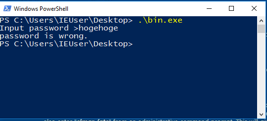

`Input password >`で入力を受け付けて、パスワードを入力させる

パスワードが違ったら`password is wrong.`と表示させて終了する


`OllyDbg`で開いてみる

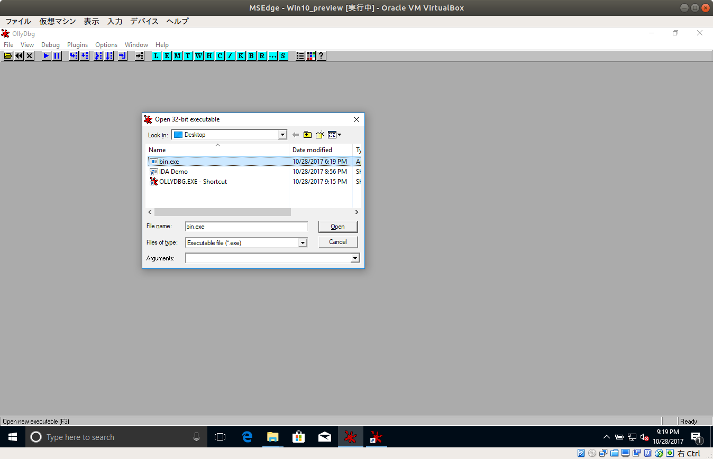

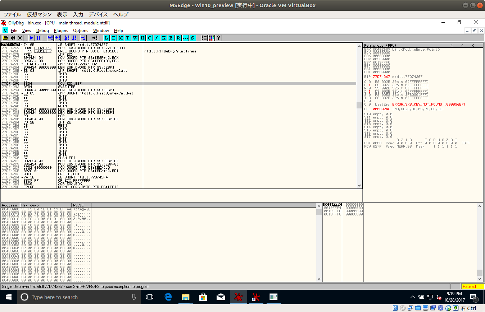

左上の方にある三角のマークを押してプログラムをmain関数の手前まで実行させる

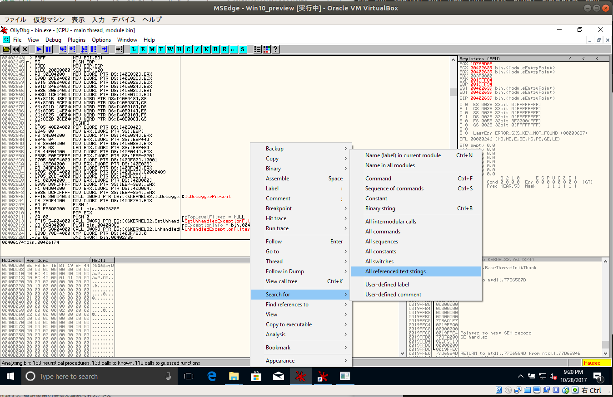

そして真ん中のウインドウで`[右クリック] > [Serch for] > [All referenced text strings]`を選択する

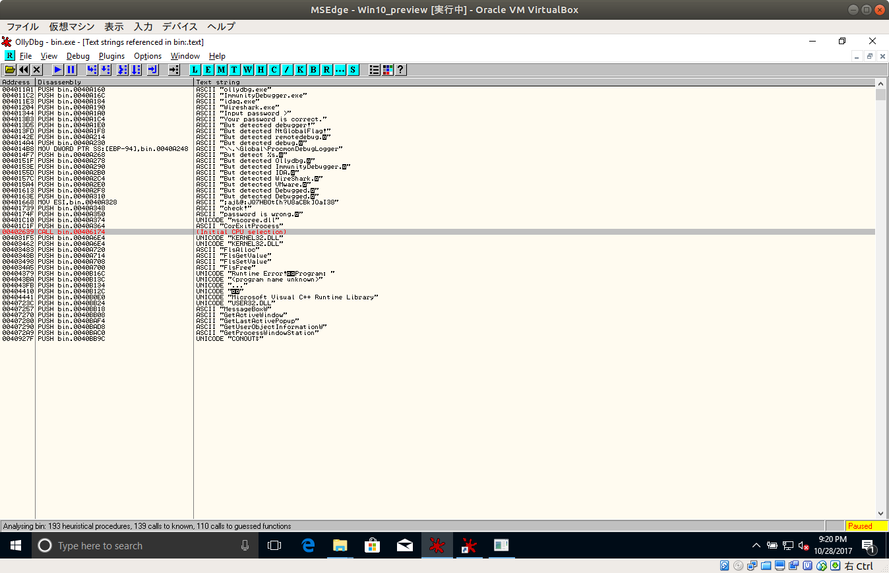

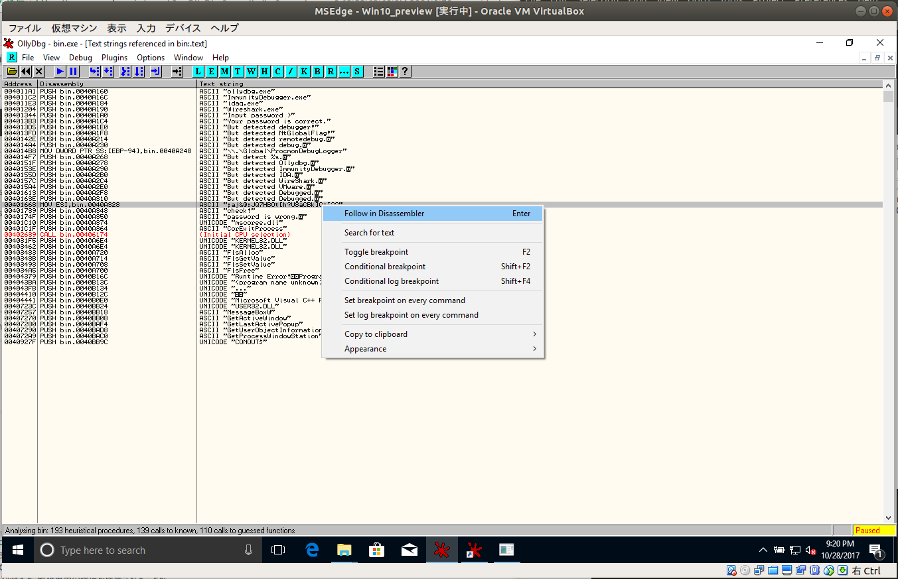

怪しそうな`;aj&@:JQ7HBOt[h?U8aCBk]OaI38`のところで`[右クリック] > [Follow in Disassembler]`をクリック

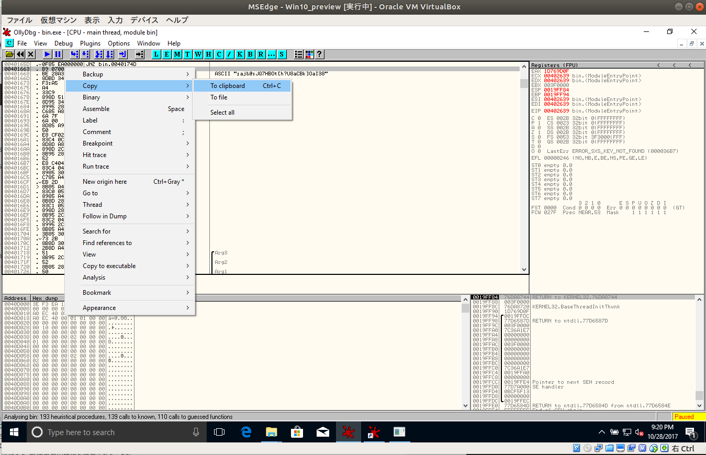

`;aj&@:JQ7HBOt[h?U8aCBk]OaI38`の一つ上の行を`[右クリック] > [Copy] > [To clipboard]`でコピーする

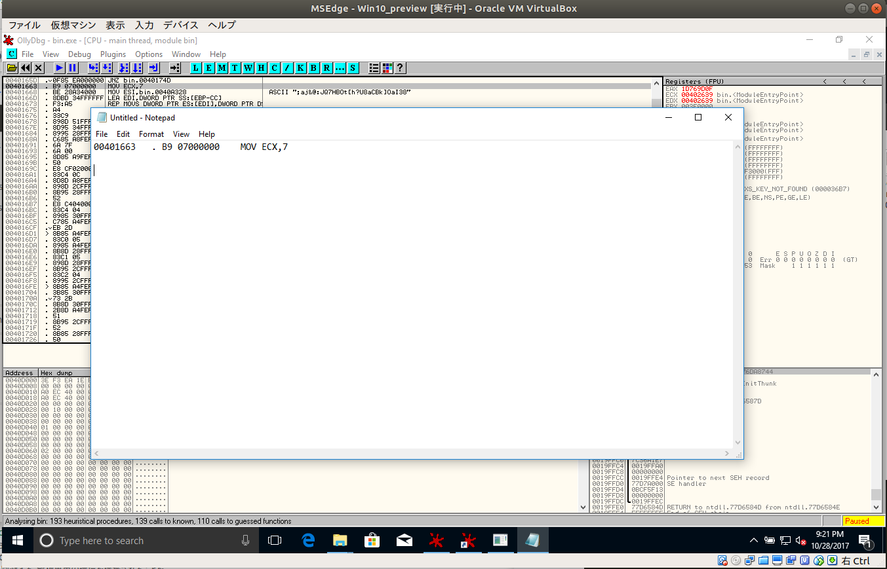

メモ帳か何かにコピーする

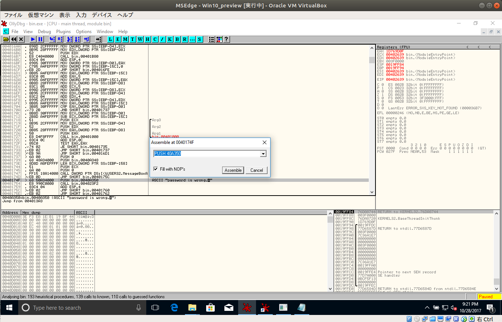

さっきコピーしたところから下を見ていくと

`password is wrong.`と表示している行の`PUSH bin.0040A350`となっているところをダブルクリックで編集して先程コピーした
`00401663`を用いて`JMP 00401663`と書き換えて`Assemble`を押してダイアログを閉じる

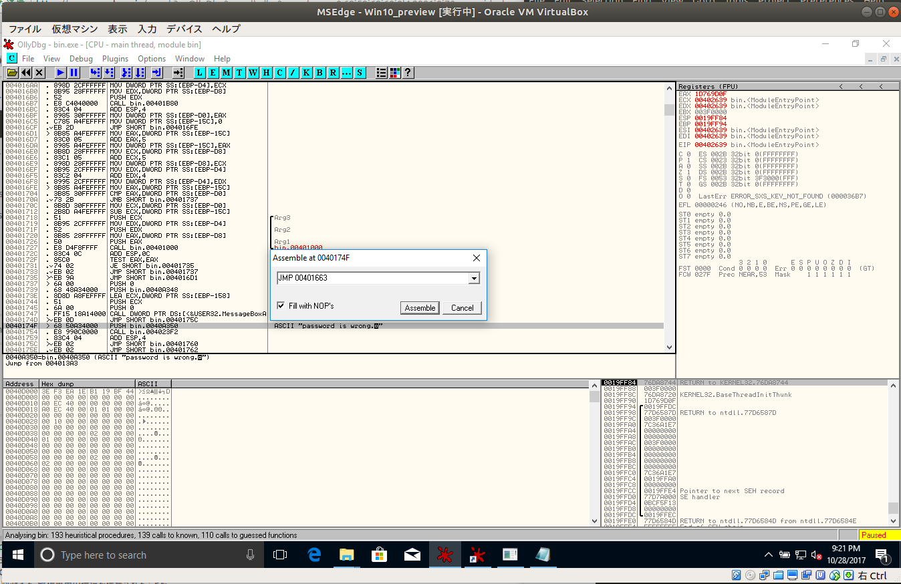

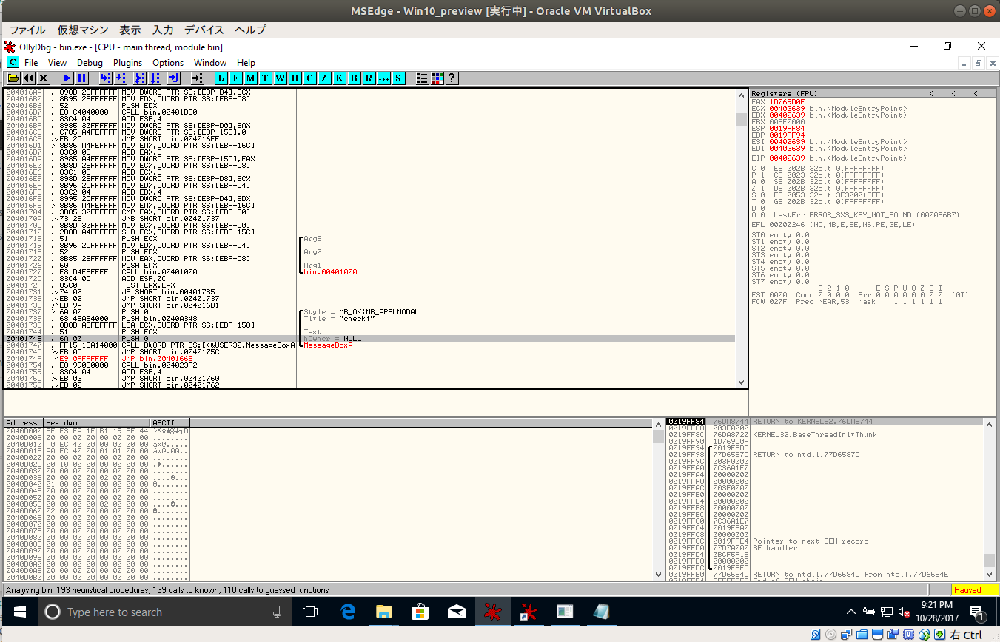

このように書き換わったらもう一度左上の三角マークを押してコンティニューする

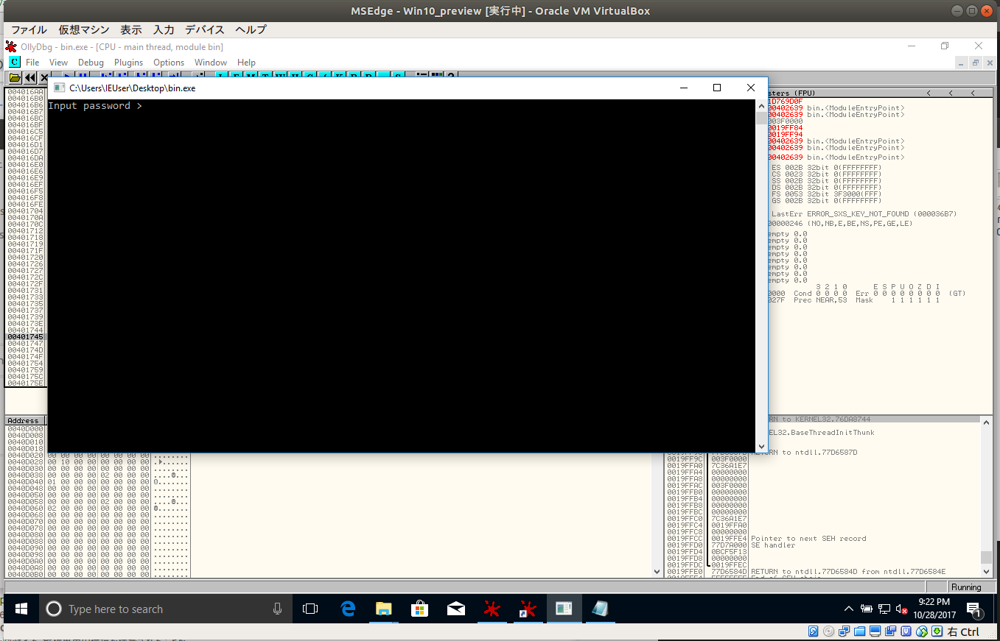

そして適当に入力すると

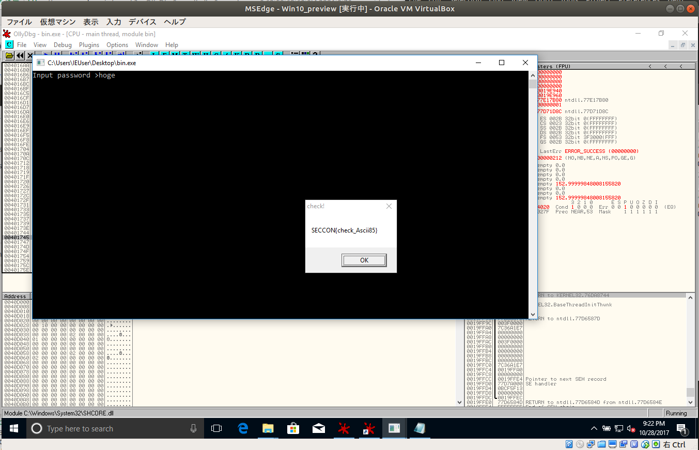

メッセージボックスとしてフラグが表示される

`SECCON{check_Ascii85}`