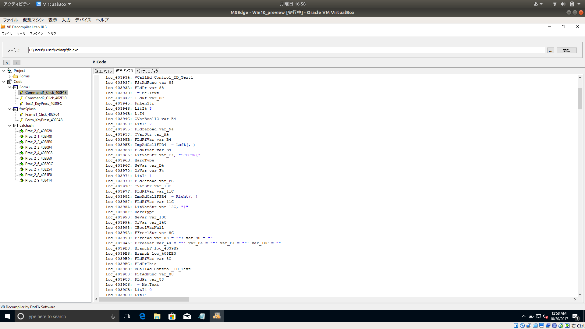

# Retrospective [Binary / 200pt]

## Problem

Reverse it.

[file](https://github.com/AkashiSN/SECCON2016-Online-CTF/blob/master/Binary/Retrospective/file)

## Answer

```plain
$ file file 
file: PE32 executable (GUI) Intel 80386, for MS Windows
$ strings file 
!This program cannot be run in DOS mode.
Rich
.text
`.data
.rsrc
MSVBVM60.DLL
020430Project1
0-C000-
p0NH
{|:O
frmSplash
Form2
Frame1
imgLogo
lblCompany
2016 SECCON Incorporated.
lblVersion
Version 1.0
lblPlatform
FOR WINDOWS
lblProductName
FLAG CHECKER
lblLicenseTo
Licensed by SECCON
lblCompanyProduct
SECCON SOFTWARE
VB5!
VB6JP.DLL
Project1
Project1
Project1
p0NH
Project1
Form1
frmSplash
calchash
Command1
C:\Program Files\Microsoft Visual Studio\VB98\VB6.OLB
Command2
Label1
Label2
Form
Text1
VBA6.DLL
Zf|J
p0NH
lblProductName
lblCompany
Frame1
lblPlatform
imgLogo
lblLicenseTo
lblVersion
lblCompanyProduct
Form1
Your trial version has expired! --- SECCON FLAG CHECKER.
Form1
Text1
Command2
Exit
Command1
Label2
15-day trial period has expired!
Label1
INPUT YOUR LICENSE KEY
MSVBVM60.DLL
MethCallEngine
EVENT_SINK_AddRef
EVENT_SINK_Release
EVENT_SINK_QueryInterface
__vbaExceptHandler
ProcCallEngine
1u  
```

`C:\Program Files\Microsoft Visual Studio\VB98\VB6.OLB`

`VB6`？？調べてみると

[Visual Basic 6が未だに生き残っている理由](https://developers.srad.jp/story/12/06/12/079206/)

どうやら化石になった言語らしい

デコンパイラーがあったのでこれを使ってみる

[VB Decompiler](https://www.vb-decompiler.org/)



[P-Code](https://ja.wikipedia.org/wiki/P%E3%82%B3%E3%83%BC%E3%83%89%E3%83%9E%E3%82%B7%E3%83%B3)という中間言語?みたいなのに変換される

