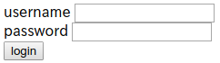

# biscuiti [Web, Crypto / 300pt]

## Problem
biscuiti

Can you login as admin?

[http://biscuiti.pwn.seccon.jp/](http://biscuiti.pwn.seccon.jp/)

[biscuiti.zip](https://github.com/AkashiSN/SECCON2016-Online-CTF/blob/master/Crypto/biscuiti/biscuiti.zip)

Note: You should estimate that exploits cost an hour.

## Answer

### 環境構築

[SECCON2016_online_CTF - GitHub](https://github.com/SECCON/SECCON2016_online_CTF/tree/master/Crypto/300_biscuiti)の

`build/README.md`にあるようにデプロイしてみる

```bash
cd build/deploy
vagrant up
sudo gem install itamae
itamae ssh --vagrant roles/main.rb
```

これで[http://localhost:10080](http://localhost:10080)で問題がホストされるようになった

### 問題を解く



問題ファイルの[index.php](https://github.com/AkashiSN/SECCON2016-Online-CTF/blob/master/Crypto/biscuiti/biscuiti/index.php)の認証部を見てみると

```php
if (isset($_POST['username']) && isset($_POST['password'])) {
    $username = (string)$_POST['username'];
    $password = (string)$_POST['password'];
    $dbh = new PDO('sqlite:../db/users.db');
    $result = $dbh->query("SELECT username, enc_password from user WHERE username='{$username}'");
    if (!$result) {
        login_page("error");
        /* DEBUG 
        $info = $dbh->errorInfo();
        login_page($info[2]);
        //*/
    }
    $u = $result->fetch(PDO::FETCH_ASSOC);
    if ($u && auth($u["enc_password"], $password)) {
        $SESSION["name"] = $u['username'];
        $SESSION["isadmin"] = $u['isadmin'];
        save_session();
        info_page();
    }
    else {
        login_page("error");
    }
}
else {
    load_session();
    if (isset($SESSION["name"])) {
        info_page();
    }
    else {
        login_page();
    }
}
```

となっていて、SQLインジェクションができそう

```sql
SELECT username, enc_password from user WHERE username='{$username}'
```
