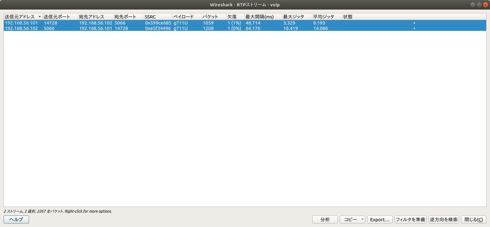

# VoIP [Forensics / 100pt]

## Problem
Extract a voice.

The flag format is SECCON{[A-Z0-9]}.

[voip.pcap](voip.pcap)

## Answer

Wiresharkで開くとIP電話のパケットのようなので、

`[電話(y)] > [RTP] > [RTPストリーム]`

2つともを選択した状態で`[分析]`をクリック

`[保存(S)] > [同期された順方向の音声ストリーム]`

から`Saved RTP Audio.au`として保存

再生するとフラグを言ってくれるので聞き取る

`SECCON{9001IVR}`