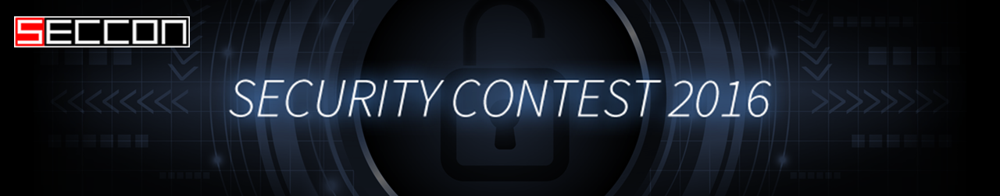
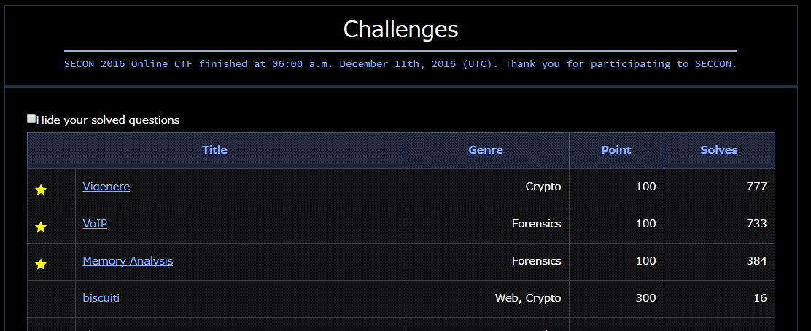

# SECCON2016-Online-CTF

__SECCONとは・・・__[http://2016.seccon.jp/about/](http://2016.seccon.jp/about/)

> 情報セキュリティをテーマに多様な競技を開催する情報セキュリティコンテストイベントです。

SECCONオンライン予選「[SECCON 2016 Online CTF](http://2016.seccon.jp/news/#124")」に参加してきました

今回はあまり解けていないのでそのあたりは・・・

今回は解いている人が多いこの3問しか解けませんでした・・・

BiPhone([@Akashi_SN](https://twitter.com/Akashi_SN),[@Snow_Poijio](https://twitter.com/Snow_Poijio),[@yamasy1549](https://twitter.com/yamasy1549))で出場し、

300点で420位でした・・・精進します
